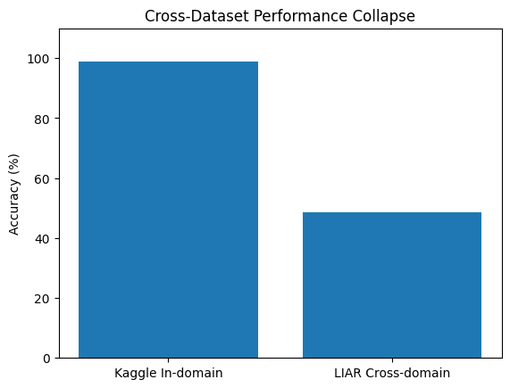

# Investigating Shortcut Learning in Transformer-Based Fake News Detection

**Do high-accuracy fake-news classifiers actually detect misinformation, or
are they keying off dataset-specific artifacts like source formatting?**

**Status:** Submitted to ICCCMLA 2026 — under review. This is not a published
or accepted paper; see [`paper/manuscript.pdf`](paper/manuscript.pdf) for the
current version.

## TL;DR

A DistilBERT model reaches near-ceiling accuracy (>99%) classifying the
Kaggle/ISOT fake-news benchmark. A classical TF-IDF + Logistic Regression
model trained on the same benchmark hits 98.91% in-domain — but collapses to
48.48% (below chance, for a binary task) when tested zero-shot on a
different dataset (LIAR), a 50.4-point drop. Explainability and corpus
analysis point to a concrete cause: REAL articles in this benchmark were
literally scraped from Reuters.com, so the token "Reuters" appears in 83% of
REAL articles vs. 1.2% of FAKE — a 71x disproportion the model can exploit
instead of learning to detect misinformation. Two controls (a text-length
truncation test and a 3-seed re-run) rule out the two most obvious
alternative explanations. This is an independent replication and extension
of findings first reported by Hoy & Koulouri (2022).

## Motivation

Benchmark accuracy above 95–99% is routinely presented as evidence that a
model "detects fake news." Shortcut learning research suggests deep models
often instead learn dataset-specific regularities — formatting, source
conventions, annotation quirks — that happen to correlate with the label in
one dataset but don't reflect the underlying task. This project tests that
concern directly for fake-news classifiers, using explainability, ablation,
and cross-dataset evaluation rather than taking in-domain accuracy at face
value.

## Research questions

1. Does a high-accuracy fake-news classifier rely on genuine
   misinformation signal, or on source/formatting artifacts specific to its
   training distribution?
2. If a specific lexical artifact (the "Reuters" token) is identified, does
   removing it causally affect accuracy — and is any such effect stable
   across random seeds, or noise?
3. Does classifier performance survive a genuine domain shift (a different
   dataset), and if not, how much of that collapse is explained by simpler
   confounds like text length?

## Main findings

*(Measured result → interpretation → limitation, kept separate throughout.)*

| Finding | Model / pipeline | Measured result |
|---|---|---|
| In-domain Kaggle accuracy | DistilBERT | >99% (99.97% on the verified balanced-test-set run) |
| In-domain Kaggle accuracy | TF-IDF + Logistic Regression | 98.91% |
| Cross-dataset collapse (Kaggle→LIAR) | TF-IDF + Logistic Regression | 98.91% → 48.48% (−50.4 points, below chance) |
| Length-confounder control | TF-IDF + Logistic Regression | Truncating Kaggle text to LIAR's length drops accuracy only 4.7 points — length explains under a tenth of the collapse |
| "Reuters" token frequency | Corpus statistics | 83.0% of REAL articles vs. 1.2% of FAKE (71.1x) |
| Reuters-removal ablation | Both pipelines | Small, consistent accuracy drop (DistilBERT: 99.97%→99.93%; TF-IDF: 98.75%→98.39%) |
| Reuters-removal stability | TF-IDF, 3 seeds (42/100/999) | Drop positive in all 3 seeds; mean 0.29 ± 0.06 points |
| Structural/stylistic artifacts | Corpus statistics | FAKE articles show far more exclamation marks (+1237%), question marks (+1054%), and capitalization (+70%) than REAL — a tabloid-style signature, separate from the Reuters finding |

**Interpretation:** the cross-dataset collapse is the strongest evidence
against genuine generalization — it's *below chance* on a binary task. The
Reuters-token finding is a real, corpus-verified, causally-tested artifact,
but its ablation effect is modest (~0.3 points), so it is evidence
*consistent with* shortcut learning, not the sole explanation for the >99%
in-domain accuracy. The results are read together as **evidence consistent
with shortcut learning** and **dataset-specific reliance within the
evaluated datasets** — not proof that the models "don't understand"
misinformation in any absolute sense.

**Limitation:** the cross-dataset test, the length-confounder control, and
the 3-seed stability check were all run on the **classical (TF-IDF +
Logistic Regression) pipeline only**. DistilBERT's cross-dataset
generalization was not directly measured — see
[Limitations](paper/manuscript.pdf) (Section VIII) for the full discussion
and why the authors consider a comparable DistilBERT collapse plausible but
unverified.

## Method overview

Two model families, two preprocessing pipelines, and a battery of
explainability/ablation/control experiments. See
[`docs/METHODOLOGY.md`](docs/METHODOLOGY.md) for the full mapping from paper
sections to code.

## Dataset summary

Kaggle Fake-and-Real-News (ISOT mirror, full articles, source-conflated
REAL=Reuters/FAKE=PolitiFact-flagged construction) and LIAR (short political
claims, six-point truthfulness collapsed to binary). Full detail, class
balances, and the reasoning behind this specific dataset pairing are in
[`docs/DATASET.md`](docs/DATASET.md). Neither raw dataset is redistributed
in this repository — see [`data/README.md`](data/README.md).

## Repository structure

```
shortcut-learning-fake-news/
├── README.md
├── LICENSE
├── CITATION.cff
├── requirements.txt
├── .gitignore
├── .gitattributes
├── paper/
│   ├── manuscript.pdf
│   └── source/paper.tex
├── src/                    # classical pipeline — no GPU needed
├── notebooks/               # DistilBERT / LIME — GPU (Colab) needed
├── results/                 # small, committed result CSVs
├── figures/
├── data/                     # empty — see data/README.md
└── docs/
    ├── REPRODUCIBILITY.md
    ├── DATASET.md
    └── METHODOLOGY.md
```

## Installation

```bash
git clone <this-repo-url>
cd shortcut-learning-fake-news
pip install -r requirements.txt
```

## Reproduction workflow

See [`docs/REPRODUCIBILITY.md`](docs/REPRODUCIBILITY.md) for the full,
verified step-by-step order, including which steps were independently
re-run against the recovered cleaned data while preparing this repository
(all matched the manuscript exactly) and which require a GPU that wasn't
available during that verification.

## Expected outputs

Running the classical pipeline (`src/*.py`, no GPU) reproduces:
`results_baselines.csv`, `token_frequency_by_class.csv`,
`structural_artifact_summary.csv`, and printed console summaries for the
cross-dataset, length-confounder, and multi-seed-variance tests — all
matching the manuscript's Tables II, V, VII, VIII, IX, and X exactly.

## Key figures



*Kaggle in-domain accuracy (98.91%) vs. zero-shot LIAR cross-domain accuracy
(48.48%) — corresponds to Fig. 2 in the manuscript.*

> **Note:** the recovered archive contained only this one figure. Its
> content matches the manuscript's **Figure 2** (cross-dataset collapse),
> not Figure 1 (the Reuters token-frequency bar chart) despite the original
> filename suggesting otherwise — it has been renamed here to match its
> actual content rather than its original (mislabeled) filename. Figure 1
> is not present in the recovered materials; the underlying numbers it
> would illustrate are in `results/token_frequency_by_class.csv`.

## Paper

[`paper/manuscript.pdf`](paper/manuscript.pdf) · [LaTeX source](paper/source/paper.tex)

## Limitations

See Section VIII of the manuscript for the full list. Headline items:
cross-dataset and length-confounder tests used the classical pipeline only;
the DistilBERT ablation, cross-dataset test, and length-confounder control
are single-run (not multi-seed) due to compute cost; LIME explanations were
computed on a sample of 20 predictions; the transformer ablation used a
15,000-article subsample; only English-language text and one transformer
architecture (DistilBERT) were evaluated.

## Citation

See [`CITATION.cff`](CITATION.cff). The manuscript is currently under
review — please cite it as a preprint/repository, not a published paper,
until its status changes.

## License

Code in this repository is MIT-licensed (see [`LICENSE`](LICENSE)). This
does **not** extend to the manuscript (ordinary copyright, author-held) or
to the third-party datasets referenced here (their own original
licenses/terms apply — see [`data/README.md`](data/README.md)).

## Author / contact

Hemanth Nomula — Department of Computer Science (AI & ML), SRM Institute of
Science and Technology.
